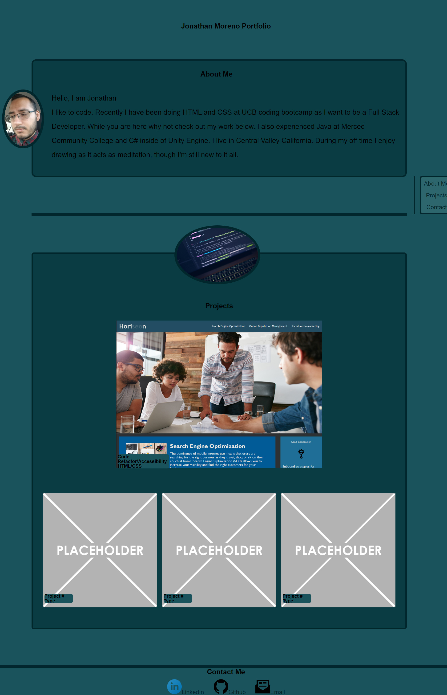

# Jonathan Moreno Portfolio

## Description

This project was made to host and showcase all of my projects. There are three sections. The first is an About ME with a quick discription and a photo. The second section is where I placed the projects. There is a capstone project meant to highlight my lastest work. At the bottom there is a footer with links to my LinkedIn, Github and Email.

Here is a screenshot of how the webpage looks:


## Code Snippets
I went with a fixed nav bar to the side of the screen for desktop. Here is what the code looks like for that:
```
.side {
    position: fixed;
    right: 0;
    width: 130px;
    text-align-last: center;
    max-height: fit-content;
    padding-left: 1%;
    border-left: solid #01272C 5px;
}
```

Here is how I created a three column grid for my project cards:
 ```
.card_c {
    display: grid;
    width: 100%;
    grid-template-columns: 1fr 1fr 1fr;
    padding: 2%;
}
 ```
The 1fr 1fr 1fr creates three colums spaced evenly.


## Installation

No installation required. Simply go to github page for viewing.

Here is the link to look see how I built the webpage with HTML and CSS.
[Github Repo](https://github.com/johnfrom209/JohnDMoreno-Portfolio)

[Deployed Page](https://johnfrom209.github.io/JohnDMoreno-Portfolio/)

## Usage

This is a webpage for viewing. Refer to the screenshot or click the Deplyed Page link.

## Credits

Added an Image from Unsplash, thank you Luca Bravo:
[Unsplash](https://unsplash.com/photos/XJXWbfSo2f0)

## Contact Me

[Linkedin](https://www.linkedin.com/in/johnfrom209/)

[View my Github Repo](https://github.com/johnfrom209)

## License
